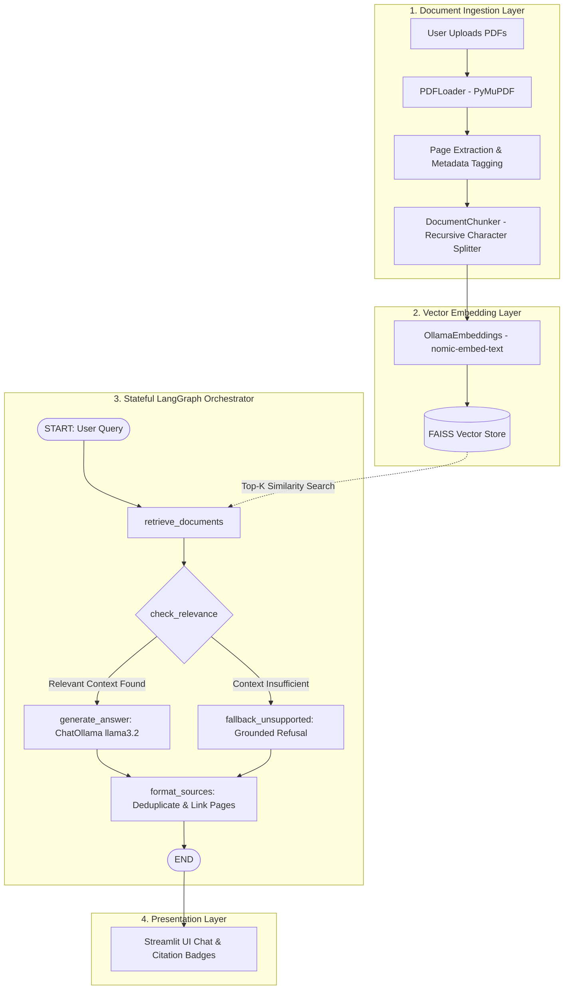

# LunorAI – Intelligent Knowledge Assistant

> **A Production-Ready, Explainable Retrieval-Augmented Generation (RAG) System Powered by LangGraph, LangChain, FAISS, and Local Ollama Models.**

---

## 📌 Problem Statement

Modern enterprise and academic professionals routinely work with high volumes of complex PDF documents—such as research papers, legal agreements, technical manuals, and financial audits. Standard large language models (LLMs) struggle with such documents due to finite context limits, high token costs, and a tendency to hallucinate unsupported facts. Furthermore, generic chatbots fail to provide verifiable source attribution, making it risky to trust their responses for mission-critical tasks.

---

## 🎯 Project Objective

**LunorAI** is an AI-powered Knowledge Assistant designed to eliminate hallucinations by grounding conversational AI responses strictly within uploaded PDF documents. Rather than functioning as a black-box chatbot, LunorAI executes an auditable, multi-stage RAG pipeline orchestrated by a deterministic **LangGraph** state machine. Every synthesized response is directly linked to verifiable document names and exact page citations.

---

## 🚀 Key Features

* **Multi-Document PDF Ingestion**: Upload single or multiple PDFs simultaneously; parse, extract, and search seamlessly across all documents.
* **Granular Page Attribution**: Automatically tracks 1-based page metadata from the source PDFs, displaying exact citations (`Source: file.pdf`, `Page: 5`) for every claim.
* **Deterministic LangGraph Orchestration**: Replaces fragile monolithic chains with an auditable state-machine workflow featuring automated context relevance validation.
* **Zero-Hallucination Grounding**: If the answer is not present in the uploaded documents, LunorAI explicitly declines to answer rather than fabricating false facts.
* **100% Offline & Private AI**: Runs entirely on your local machine using **Ollama** (`llama3.2`) and local dense vector embeddings (`nomic-embed-text`). Zero external API keys or subscription fees required.
* **High-Performance Vector Search**: Utilizes **FAISS** (Facebook AI Similarity Search) with normalized cosine similarity thresholding to isolate semantically relevant document chunks.
* **Modern Streamlit Interface**: Clean, responsive UI with real-time indexing progress, chat history persistence, expandable source citation drawers, and conversation reset.

---

## 🏗️ System Architecture & Data Flow



---

## 🔄 How the RAG Pipeline Works Step-by-Step

1. **PDF Text Extraction**: PyMuPDF parses uploaded PDF streams into LangChain `Document` objects while capturing `source` filename, 1-based `page` number, and `total_pages`.
2. **Semantic Chunking**: The `DocumentChunker` breaks lengthy text into overlapping segments (default: 800 characters, 150 character overlap) while preserving metadata across all fragments.
3. **Local Embedding Generation**: Chunks are transformed into 768-dimensional dense vector embeddings using `nomic-embed-text` hosted locally via Ollama.
4. **FAISS Indexing**: Embeddings and document metadata are stored in an in-memory or persisted FAISS vector index.
5. **Semantic Retrieval**: When a question is submitted, FAISS executes cosine similarity search with distance thresholding to fetch the top-k most relevant chunks.
6. **Relevance Validation**: The LangGraph state machine evaluates whether retrieved context is substantive and exceeds confidence thresholds.
7. **Grounded Answer Generation**: A strictly parameterized prompt provides the retrieved context to `llama3.2` with instructions to answer *only* from context.
8. **Citation Formatting**: Sources are extracted, deduplicated, and displayed with document names, page numbers, and expandable snippet previews.

---

## 🛠️ Technology Stack

| Component | Technology | Rationale |
|---|---|---|
| **Language** | Python 3.11 | Broad compatibility across modern AI and scientific packages. |
| **Web Interface** | Streamlit | Rapid, modern UI development with native session state and streaming chat widgets. |
| **LLM Engine** | Ollama (`llama3.2`) | Fast, capable, low-latency 3B local LLM with strong instruction-following capabilities. |
| **Embedding Engine** | Ollama (`nomic-embed-text`) | 768-dimensional embeddings trained specifically for high-accuracy semantic retrieval. |
| **Vector Index** | FAISS (`faiss-cpu`) | High-performance C++ vector index supporting fast similarity search and relevance filtering. |
| **Orchestration** | LangGraph | Deterministic, cyclic state machine framework providing visibility into RAG transitions. |
| **Document Framework** | LangChain Core & Community | Standardized document loaders, prompt templates, and model wrappers. |
| **PDF Parsing** | PyMuPDF (`pymupdf`) | Robust, high-speed document text and layout extraction. |

---

## 📂 Project Structure

```
lunorai/
│
├── app.py                     # Streamlit frontend & interactive chat interface
├── requirements.txt           # Verified, compatible Python package dependencies
├── README.md                  # Complete project documentation & setup guide
├── .gitignore                 # Excludes virtual environments, caches, and local stores
│
├── config/
│   ├── __init__.py
│   └── settings.py            # Central configuration (Ollama URL, models, chunk sizes)
│
├── ingestion/
│   ├── __init__.py
│   ├── pdf_loader.py          # PyMuPDF-based text and metadata extractor
│   └── chunker.py             # Recursive character splitter preserving page tags
│
├── embeddings/
│   ├── __init__.py
│   └── embedding_model.py     # Local embedding model factory (nomic-embed-text)
│
├── vectorstore/
│   ├── __init__.py
│   └── faiss_store.py         # FAISS indexing, similarity search, and persistence
│
├── graph/
│   ├── __init__.py
│   ├── state.py               # RAGState TypedDict definition
│   └── workflow.py            # LangGraph state machine (retrieve -> check -> generate -> cite)
│
├── llm/
│   ├── __init__.py
│   └── ollama_model.py        # ChatOllama client and connectivity diagnostics
│
├── prompts/
│   └── rag_prompt.txt         # Strict grounding & anti-hallucination prompt template
│
├── utils/
│   ├── __init__.py
│   └── helpers.py             # File validation, citation formatting & deduplication
│
└── tests/
    └── test_rag_pipeline.py   # Automated end-to-end test suite
```

---

## ⚙️ Installation & Setup

### 1. Prerequisites
* **Python 3.10, 3.11, or 3.12** installed on your system.
* **Ollama** installed on your operating system ([Download Ollama](https://ollama.com/download)).

### 2. Configure Local Models with Ollama
Make sure the Ollama daemon is running, then pull the LLM and embedding models:

```bash
# Pull the default generation model
ollama pull llama3.2

# Pull the high-performance local embedding model
ollama pull nomic-embed-text
```

Verify that both models are listed:
```bash
ollama list
```

### 3. Clone / Navigate to the Project
```bash
cd path/to/lunorai
```

### 4. Create and Activate Virtual Environment
Using standard Python `venv`:
```bash
# Windows
python -m venv .venv
.venv\Scripts\activate

# Linux / macOS
python3 -m venv .venv
source .venv/bin/activate
```

Or using `uv` (recommended for ultra-fast setup):
```bash
uv venv .venv --python 3.11
.venv\Scripts\activate
```

### 5. Install Dependencies
```bash
pip install -r requirements.txt
```

---

## 🚀 Running the Application

Launch the Streamlit web server:
```bash
streamlit run app.py
```

Open your web browser and navigate to:
```
http://localhost:8501
```

### Quick Walkthrough
1. Check the **System Status** badge in the sidebar (should display green: `● Ollama Online: llama3.2`).
2. Click **"Browse files"** to upload one or more PDF files.
3. Click **"🚀 Process Documents"** to extract, chunk, and index the text into FAISS.
4. Type your question in the chat input box at the bottom.
5. Inspect the synthesized answer and expand the **"📚 Source Citations"** card to view the exact document name, page number, and source passage.

---

## 🧪 Running Automated Tests

LunorAI includes an automated end-to-end verification suite that tests:
* PDF loading and multi-page metadata retention
* Text chunking without metadata loss
* FAISS vector indexing
* LangGraph state compilation and node transitions
* Grounded question answering
* Anti-hallucination safety behavior on out-of-domain questions

Run the test suite:
```bash
python tests/test_rag_pipeline.py
```

---

## 🧠 Architectural Deep Dive

### LangChain's Role
LangChain provides the modular building blocks for standardizing document abstractions:
- `Document`: Carries text payload alongside structured metadata (`source`, `page`, `chunk_num`).
- `RecursiveCharacterTextSplitter`: Splits documents respecting natural paragraph and sentence structure.
- `OllamaEmbeddings` and `ChatOllama`: Clean, asynchronous-ready interfaces for local inference.

### LangGraph's Role
While traditional RAG pipelines often rely on static sequential chains (`load -> retrieve -> stuff -> prompt`), real-world production systems require **state machines with branching logic**. 

LangGraph coordinates LunorAI through a stateful graph:
- **`retrieve_documents`**: Fetches candidates using vector similarity.
- **`check_relevance`**: Validates whether retrieved documents meet quality and density thresholds.
- **Dynamic Branching**: Routes to `generate_answer` if valid context exists; otherwise routes to `fallback_unsupported`.
- **`format_sources`**: Formats verified citations and prevents misleading citations when no supporting text exists.

### FAISS's Role
FAISS provides an in-memory, highly-optimized Euclidean and Cosine index for dense vector representations. It enables sub-millisecond similarity lookups even across hundreds of document chunks, with support for score normalization and threshold filtering.

### Embedding Model: `nomic-embed-text`
`nomic-embed-text` is an open-weights, high-performance embedding model that produces 768-dimensional vectors. It outperforms older models like OpenAI's `text-embedding-ada-002` on standard MTEB benchmarks while running entirely locally via Ollama with 0 API costs.

---

## 📸 Screenshots

*(Placeholder: Upload screenshots of your LunorAI interface here)*

| Knowledge Base Indexing | Grounded Answer & Citations | Out-of-Context Refusal |
|:---:|:---:|:---:|
| `[Screenshot: Sidebar & Ingestion]` | `[Screenshot: Chat with Citations]` | `[Screenshot: Safety Notice]` |

---

## 🔮 Future Improvements

1. **Hybrid Retrieval (BM25 + Dense FAISS)**: Implement Reciprocal Rank Fusion (RRF) combining keyword search with semantic vectors.
2. **Semantic Re-ranking**: Integrate a local cross-encoder re-ranker (e.g., FlashRank or BGE-Reranker) to refine top-k chunk ordering prior to LLM synthesis.
3. **Multi-Modal Document Ingestion**: Extract figures, diagrams, and tables using vision models.
4. **Session Persistence**: Persist vector stores in SQLite or ChromaDB for multi-session reuse.

---

## 🤖 AI Tools Disclosure

In accordance with internship evaluation standards and academic integrity guidelines, this project utilized:
- **Google Antigravity & LLM Coding Assistants**: Used during development for architectural scaffolding, test generation, and documentation drafting.
- **Local LLM Models (`llama3.2`, `nomic-embed-text`)**: Executed locally on Ollama to perform inference, embedding generation, and runtime verification.
- All code, state graphs, ingestion logic, and documentation were verified and tested locally in the development environment.

---

## 📄 License

This project is developed as an educational internship assignment and is released under the **MIT License**.
